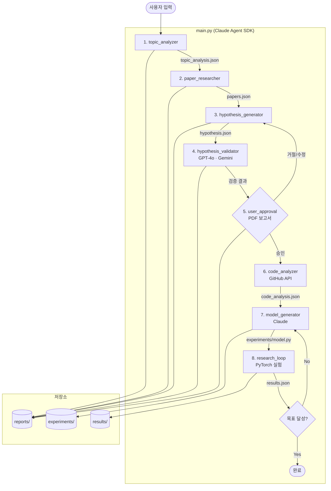

# AI-Driven Deep Learning Research Automation

## 프로젝트 목표
사용자가 연구 주제를 정하면, Claude가 AI 연구자로서 논문 조사 → 가설 수립 → 다중 LLM 검증 →
사용자 승인 → 코드 분석 → 모델 생성 → Research Loop까지 전 과정을 자동화한다.

## 아키텍처



## 프로젝트 구조

```
project/
├── CLAUDE.md                    # 규칙 + 구조 참조
├── main.py                      # 전체 파이프라인 진입점
├── .gitlab-ci.yml               # GitLab CI/CD 실험 실행 파이프라인
├── lab/                         # 각 단계 모듈 → lab/CLAUDE.md 참조
├── experiments/                 # 생성된 모델 코드 + 패키지 템플릿
├── results/                     # 실험 결과 JSON + previous_results.jsonl
├── reports/                     # 각 단계 보고서
├── schemas/                     # JSON 스키마 (experiment_spec, result_summary, revision_request)
├── docs/                        # 시스템 설계 문서, merge checklist
└── tools/                       # tool registry
```

## Lazy Loading 규칙
- 이 파일(root `CLAUDE.md`)은 **규칙과 구조 참조만** 포함한다
- 각 서브폴더의 상세 내용은 해당 폴더의 `CLAUDE.md`에서 관리한다 (lazy load)
- 서브폴더 `CLAUDE.md` 목록:

| 폴더 | CLAUDE.md | 내용 |
|---|---|---|
| `lab/` | `lab/CLAUDE.md` | 파이프라인 모듈 상세, 실행 명령, LLM 설정, 데이터 스펙 |
| `tools/` | `tools/CLAUDE.md` | tool 스키마 목록, execute_tool 라우터 규칙 |
| `experiments/` | `experiments/CLAUDE.md` | Fabric 코딩 규칙, 파일 소유권, 수정 정책(Path A/B/C), metric 명칭 규칙 |
| `schemas/` | — | experiment_spec / result_summary / revision_request JSON Schema |
| `docs/` | — | system_design.md (12섹션 설계서), merge_checklist.md |

## 문서 규칙
- 아키텍처·흐름 다이어그램은 반드시 Mermaid로 작성 (ASCII 다이어그램 사용 금지)
- 새 서브폴더 추가 시 해당 폴더에 `CLAUDE.md` 생성 후 위 표에 등록

## 코딩 규칙
- 각 모듈은 독립적으로 실행 및 테스트 가능하게 설계
- 모든 LLM 호출은 결과를 `reports/`에 캐시하여 중복 API 호출 방지
- 에러 발생 시 해당 단계 결과에 `error` 필드 기록 후 계속 진행
- Claude API 호출 시 `thinking: {"type": "adaptive"}` 사용 (복잡한 분석)
- **하드코딩 금지 — 모든 값은 일반화(generalization) 또는 모듈화(modularization)로 작성**
  - 레이아웃·크기: 구성 요소 치수로부터 계산해서 유도, 임의 상수 직접 삽입 금지
  - 반복 로직: 함수·클래스로 모듈화, 동일 패턴 인라인 중복 금지
  - 설정값: 상단 상수 또는 config로 분리, 코드 중간에 매직 넘버 삽입 금지

## 환경 설정
```bash
pip install anthropic openai google-generativeai torch torchvision requests

export ANTHROPIC_API_KEY="..."
export OPENAI_API_KEY="..."
export GOOGLE_API_KEY="..."
export GITHUB_TOKEN="..."   # GitHub API 검색 속도 향상
```
