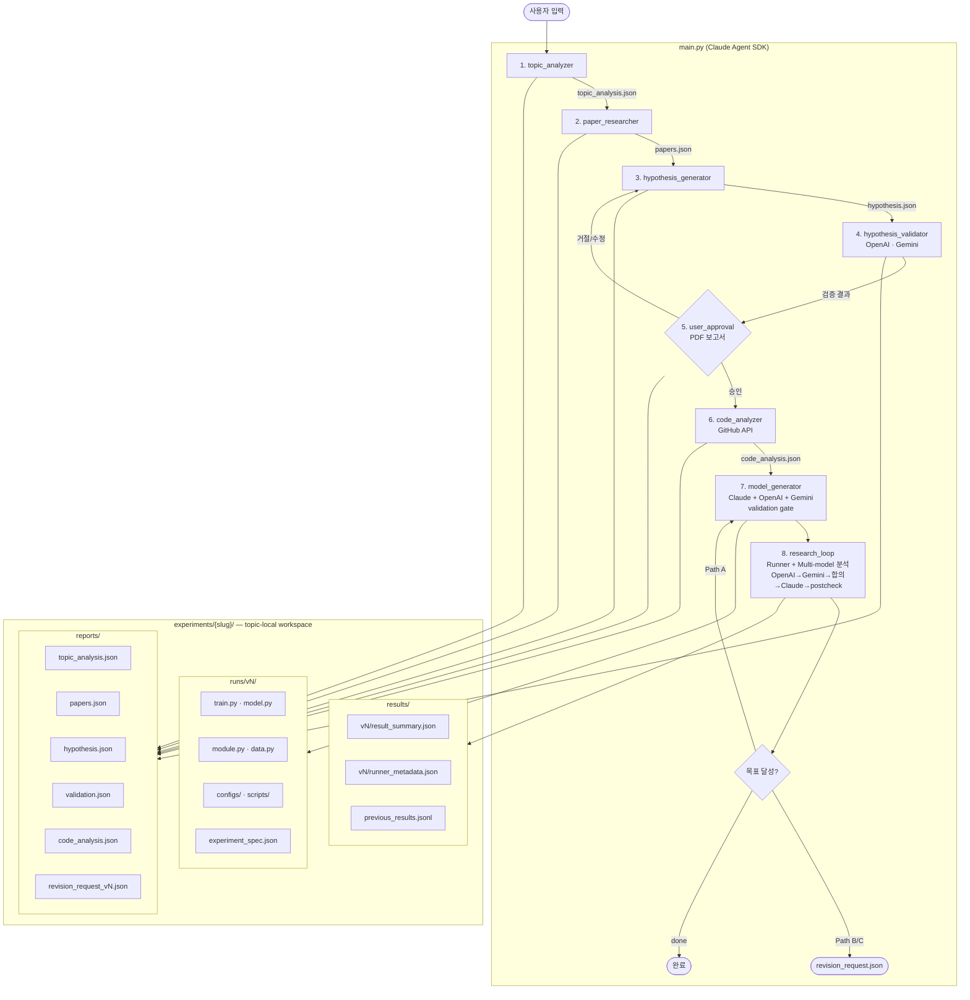
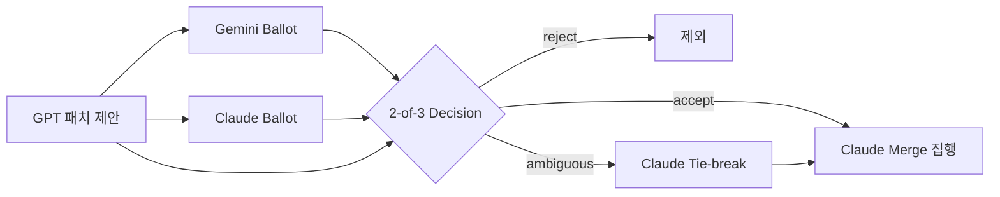
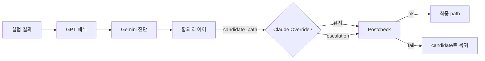

# AI-Driven Deep Learning Research Automation

## 프로젝트 목표
사용자가 연구 주제를 정하면, Claude가 AI 연구자로서 논문 조사 → 가설 수립 → 다중 LLM 검증 →
사용자 승인 → 코드 분석 → 모델 생성 → Research Loop까지 전 과정을 자동화한다.

## 아키텍처



## 프로젝트 구조

```
project/
├── CLAUDE.md                    # 규칙 + 구조 참조
├── main.py                      # 전체 파이프라인 진입점
├── todo.md                      # 연구 주제 입력 파일 (main.py 기본 입력)
├── .github/workflows/           # GitHub Actions CI (실험 실행 파이프라인)
├── lab/                         # 각 단계 모듈 → lab/CLAUDE.md 참조
│   ├── runners.py               # Runner 추상화 (local / GitHub Actions)
│   └── ...
├── experiments/                 # 주제별 workspace ({slug}/reports|runs|results/) + template
├── schemas/                     # JSON 스키마 (experiment_spec, result_summary, revision_request)
├── docs/                        # 시스템 설계 문서, merge checklist
└── tools/                       # tool registry
```

## Lazy Loading 규칙
- 이 파일(root `CLAUDE.md`)은 **규칙과 구조 참조만** 포함한다
- 각 서브폴더의 상세 내용은 해당 폴더의 `CLAUDE.md`에서 관리한다 (lazy load)
- 서브폴더 `CLAUDE.md` 목록:

| 폴더 | CLAUDE.md | 내용 |
|---|---|---|
| `lab/` | `lab/CLAUDE.md` | 파이프라인 모듈 상세, 실행 명령, LLM 설정, 데이터 스펙 |
| `tools/` | `tools/CLAUDE.md` | tool 스키마 목록, execute_tool 라우터 규칙 |
| `experiments/` | `experiments/CLAUDE.md` | Fabric 코딩 규칙, 파일 소유권, 수정 정책(Path A/B/C), validation gate, multi-model 파이프라인 규칙, metric 명칭 규칙 |
| `schemas/` | — | experiment_spec / result_summary / revision_request JSON Schema |
| `docs/` | — | system_design.md (아키텍처 설계서), merge_checklist.md |

## 문서 규칙
- 아키텍처·흐름 다이어그램은 반드시 Mermaid로 작성 (ASCII 다이어그램 사용 금지)
- 새 서브폴더 추가 시 해당 폴더에 `CLAUDE.md` 생성 후 위 표에 등록

## 코딩 규칙
- 각 모듈은 독립적으로 실행 및 테스트 가능하게 설계
- 모든 LLM 호출은 결과를 `experiments/{slug}/reports/`에 캐시하여 중복 API 호출 방지
- 에러 발생 시 해당 단계 결과에 `error` 필드 기록 후 계속 진행
- Claude API 호출 시 `thinking: {"type": "adaptive"}` 사용 (복잡한 분석)
- **하드코딩 금지 — 모든 값은 일반화(generalization) 또는 모듈화(modularization)로 작성**
  - 레이아웃·크기: 구성 요소 치수로부터 계산해서 유도, 임의 상수 직접 삽입 금지
  - 반복 로직: 함수·클래스로 모듈화, 동일 패턴 인라인 중복 금지
  - 설정값: 상단 상수 또는 config로 분리, 코드 중간에 매직 넘버 삽입 금지

## 환경 설정

### 로컬 실행
```bash
pip install anthropic openai google-generativeai torch torchvision requests

export ANTHROPIC_API_KEY="..."
export OPENAI_API_KEY="..."
export GOOGLE_API_KEY="..."
export GITHUB_TOKEN="..."   # GitHub API 검색 속도 향상
```

### GitHub Actions 실행 전제조건

`--runner-type github` 사용 시 아래 환경이 추가로 필요하다.

**환경변수 (로컬 → runners.py에서 읽음)**

| 변수 | 설명 |
|---|---|
| `GITHUB_TOKEN` | Personal Access Token (workflow + contents scope 필수) |
| `GITHUB_OWNER` | 레포지토리 소유자 (예: `myorg`) |
| `GITHUB_REPO` | 레포지토리 이름 (예: `my-research`) |
| `GITHUB_REF` | 트리거 브랜치 (기본값: `main`) |
| `GITHUB_WORKFLOW` | 워크플로우 파일명 (기본값: `experiment.yml`) |

**GitHub Secrets (workflow 내부에서 필요)**

- `ANTHROPIC_API_KEY` — Claude API 키
- `OPENAI_API_KEY` — OpenAI API 키
- `GOOGLE_API_KEY` — Gemini API 키

**인프라**

- organization-level self-hosted runner (최대 8개: `gpu-runner-0` ~ `gpu-runner-7`)
  - `runs-on: [self-hosted, gpu]` 라벨 필요
  - runner 없으면 `train` 단계에서 `runner not found` 오류 발생
- GPU pinning: `gpu-runner-N` → `CUDA_VISIBLE_DEVICES=N` (workflow가 runner.name에서 자동 파싱)
- 실행 환경: 장수 Docker 컨테이너 `nextmi-dev-loki` 내부 conda env `yhn`
  - workflow는 `docker exec` + `conda run -n yhn`으로 실행
  - host와 container의 프로젝트 경로는 동일 (바인드 마운트)
- PAT scope 부족 시 dispatch는 성공하나 run 조회에서 403/404 발생

**workflow 입력 계약**

```yaml
inputs:
  experiment_pkg: "experiments/{slug}/runs/v1"
  config_file:    "configs/default.yaml"
  smoke_only:     "false"       # "true"이면 smoke test만 실행
  dispatch_id:    "<UUID — runners.py가 생성>"
  project_dir:    "<컨테이너 바인드 마운트 경로 — runners.py가 자동 감지>"
```

**artifact 계약 (experiment-results)**

runner가 수집하는 최종 artifact:
- `artifacts/metrics/final_metrics.json` — raw metric dict
- `runner_metadata.json` — 실행 메타데이터

canonical `result_summary.json`은 `research_loop.py`만 생성한다 (workflow 생성 금지).

**canonical `result_summary.json` 생성 책임**

- workflow는 raw metrics (`artifacts/metrics/final_metrics.json`)와 `runner_metadata.json`만 생성한다.
- canonical `result_summary.json`은 `research_loop.py`가 `experiment_spec.json`과 `RunResult`를 기반으로 생성한다.
- 저장 위치: `experiments/{slug}/results/vN/result_summary.json`
- revision 판단과 `previous_results.jsonl` 누적은 canonical summary만 사용한다.

**Runner 추상화 (`RunResult` 계약)**

`LocalRunner`와 `GitHubActionsRunner`는 동일한 `RunResult` 계약을 만족한다:

| 필드 | 타입 | 설명 |
|---|---|---|
| `status` | str | `success`, `failed`, `smoke_failed`, `timeout`, `metrics_parse_error` |
| `returncode` | int | 프로세스 종료 코드 (GitHub: 0=성공, 1=실패) |
| `metrics` | dict | `METRICS:{...}` stdout에서 파싱한 metric dict |
| `metadata` | dict | runner 메타데이터 (아래 스키마 참조) |
| `stdout_lines` | list | stdout 라인 목록 (최대 500줄) |
| `stderr_tail` | str | stderr 마지막 부분 (디버깅용) |

**`runner_metadata.json` 필수 스키마**

| 필드 | 설명 |
|---|---|
| `runner` | `"local"` 또는 `"github"` |
| `job_id` | GitHub run ID 또는 local PID |
| `pipeline_id` | GitHub run number 또는 빈 문자열 |
| `dispatch_id` | `smoke_{uuid}` 또는 `train_{uuid}` (GitHub) / 빈 문자열 (local) |
| `runner_name` | GitHub self-hosted runner 이름 (GitHub only) |
| `duration_s` | 실행 시간 (초, float) |
| `job_url` | GitHub Actions run URL (브라우저 열기 가능) |
| `artifact_uri` | artifact API URL 또는 추적 가능한 식별값 |
| `git_sha` | 실행 시점의 git commit SHA |
| `git_branch` | 실행 브랜치 |
| `experiment_pkg` | 실험 패키지 경로 |
| `started_at` | ISO8601 시작 시간 |
| `finished_at` | ISO8601 종료 시간 |

**`dispatch_id` 기반 run 식별**

- `GitHubActionsRunner`는 dispatch 전 고유 `dispatch_id`를 생성한다 (`smoke_{uuid}` / `train_{uuid}`).
- workflow input으로 전달되어 `runner_metadata.json`에 기록된다.
- run 식별 시 `dispatch_id`를 기준으로 정확한 run만 선택한다.
- 병렬 실행에서도 안전하게 run을 구분한다.

**failure semantics**

GitHub 실행 실패 시 아래 상황을 구분한다:

| 실패 유형 | 설명 |
|---|---|
| dispatch 실패 | workflow_dispatch API 호출 실패 |
| run 식별 실패 | dispatch_id에 대응하는 run을 찾지 못함 |
| poll timeout | 최대 대기 시간 초과 |
| workflow failure | workflow job 실패 |
| artifact 다운로드 실패 | artifact zip 다운로드 또는 파싱 실패 |
| final_metrics.json 누락 | artifact 내 final_metrics.json 없음 |
| runner_metadata.json 누락 | artifact 내 runner_metadata.json 없음 |
| metrics parse 실패 | `METRICS:{...}` stdout 라인 파싱 실패 |

## 하위 호환성 정책

과거 구조는 더 이상 지원하지 않는다. 아래 구조가 발견되면 명시적 오류로 처리한다.

| 과거 구조 | 현재 구조 | 처리 방침 |
|---|---|---|
| `experiments/{slug}_vN/` | `experiments/{slug}/runs/vN/` | 오류: 경로를 직접 변경하거나 새로 생성 |
| 전역 `results/` | `experiments/{slug}/results/` | 오류: topic slug를 명시해 재실행 |
| 전역 `reports/` | `experiments/{slug}/reports/` | 오류: topic slug를 명시해 재실행 |

자동 마이그레이션은 제공하지 않는다. 구 구조 발견 시 새 구조로 직접 재생성한다.

## Hypothesis Implementation Audit (가설 구현 감사)

코드 생성(model_generator) 단계에서 `hypothesis.json`의 핵심 항목이 실제 코드에 구현되었는지 자동으로 감사한다.

### hypothesis_contract (experiment_spec.json 내)
```json
{
  "hypothesis_contract": {
    "mechanism": "가설의 expected_mechanism (핵심 작동 원리)",
    "target_metric_raw": "topic input의 target_metric 원문",
    "constraints_raw": "topic input의 constraints 원문",
    "architecture_hint": "가설의 architecture 제안"
  }
}
```

### 3가지 감사 함수

| 감사 | 방식 | 판정 기준 |
|---|---|---|
| `mechanism_audit` | Claude 기반 | mechanism이 코드의 아키텍처/학습/데이터 처리 요소에 구현되었는가 |
| `metric_audit` | 순수 코드 검사 | primary_metric, required_keys가 spec/code/METRICS stdout에 일관되게 존재하는가 |
| `constraints_audit` | 키워드 + 코드 검사 | param budget, single GPU, pretrained 금지 등 제약이 config/코드에 반영되었는가 |

### 감사 결과 저장
- `artifacts/mechanism_audit.json`
- `artifacts/metric_audit.json`
- `artifacts/constraints_audit.json`

### validation gate 확장 (hard / soft gate)
- 기존 syntax/smoke/forward 검증 이후 3가지 감사 실행
- **hard gate** (차단): metric 미구현, constraints 위반, mechanism 미구현(명시된 경우)
- **soft gate** (warning만): mapping 모호, optional metric 불완전, 제약 해석 애매
- `ok = syntax_ok and smoke_ok and hard_audit_ok`
- hard audit 실패 시 repair 1회 → 재검증 → 여전히 실패 시 패키지 차단
- `failure_detail`, `hard_failures` 필드로 구조적 실패 사유 기록

### result_summary.json 연동
- `hypothesis_implementation` 필드로 3가지 감사 결과 포함
- research_loop의 Path 결정 시 mechanism 구현 여부 반영:
  - mechanism 미구현 → Path A 우선 (구현 문제)
  - mechanism 구현 + 반복 반박 → Path B/C 검토 가능
  - mechanism 미구현 상태에서 Path C 절대 금지

## Stage 7: Patch Ballot + 2-of-3 Merge

코드 생성(model_generator) 단계에서 GPT 패치 채택을 **Claude 단독 결정이 아닌 3자 투표**로 결정한다.

> **참고**: `hypothesis_contract`(mechanism, target_metric_raw, constraints_raw, architecture_hint)는
> 위 "Hypothesis Implementation Audit" 섹션에서 정의되며, Stage 7 코드 생성 시 experiment_spec.json에
> 포함되어 모든 LLM 프롬프트에 관통 전달된다.

### 흐름



### 투표 규칙

| 투표 결과 | 조건 | 결정 |
|---|---|---|
| accept ≥ 2 | GPT(implicit accept) + Gemini/Claude 중 1개 accept | **accept** |
| reject ≥ 2 | Gemini + Claude 모두 reject | **reject** |
| comparability_risk=high | 누구든 1명이라도 high | **reject** (hard rule) |
| 그 외 | 명확한 다수 없음 | **ambiguous** → Claude tie-break |

### Claude Merge 제한
- reject된 패치는 merge prompt에서 제외
- Claude는 새 아이디어 추가 시 `pseudo-patch`로 기록
- merge_log에 각 패치의 투표 결과 포함

### 산출물 (proposals/)
- `gpt_patch_*.json` — GPT 패치 제안
- `gemini_patch_ballot_*.json` — Gemini 패치별 투표
- `claude_patch_ballot_*.json` — Claude 패치별 투표
- `merge_decision_*.json` — 2-of-3 최종 결정
- `gemini_review_*.json` — Gemini 설계 리뷰 (기존 유지)

## Stage 8: Consensus-Locked Path + Override Reviewer

실험 결과 분석에서 **합의 레이어가 기본 path를 확정**하고, Claude는 **예외적 override만** 수행한다.

### 흐름



### Claude Override 규칙

| override | 허용 조건 |
|---|---|
| A → B | GPT B/C 제안 + agreement≥medium + n_runs≥2 |
| B → C | agreement=strong + evidence=high + n_runs≥3 + escalation_risk≠blocked |
| A → C | **금지** (skip 불가) |
| B → A, C → A/B | **금지** (downgrade 불가) |
| done → any | **금지** |

### Postcheck (Override 최종 허가자)
- Claude override를 deterministic하게 재검증
- override 조건 미충족 시 candidate_path로 자동 복귀
- mechanism 미구현 시 Path C 절대 금지 (유지)

### Decision Payload 구조
```json
{
  "candidate_path": "A",
  "candidate_source": "consensus_layer",
  "claude_override": false,
  "final_path": "A",
  "accepted_patch_indexes": [0, 1],
  "accepted_patch_source": "stage7_ballot",
  "override_rule_check": { "postcheck_ok": true },
  "decision_reason": "...",
  "justification": "..."
}
```

## 전체 Lifecycle 예시 (topic 하나)

```text
1. topic 입력 → experiments/industrial_image_denoising/reports/topic_analysis.json 생성
2. 논문 검색  → experiments/industrial_image_denoising/reports/papers.json
3. 가설 생성  → experiments/industrial_image_denoising/reports/hypothesis.json
4. 가설 검증  → experiments/industrial_image_denoising/reports/validation.json
5. 사용자 승인 → experiments/industrial_image_denoising/reports/approval.json
6. 코드 분석  → experiments/industrial_image_denoising/reports/code_analysis.json
7. 모델 생성  → experiments/industrial_image_denoising/runs/v1/ (Fabric 패키지)
8. 실험 실행:
   - smoke → pass
   - train → METRICS:{"psnr": 28.5, "ssim": 0.82}
9. 결과 저장:
   - experiments/industrial_image_denoising/results/v1/result_summary.json  (research_loop 생성)
   - experiments/industrial_image_denoising/results/v1/runner_metadata.json
   - experiments/industrial_image_denoising/results/previous_results.jsonl  (누적)
10. 목표 미달(psnr < 30) → Path A:
    - experiments/industrial_image_denoising/runs/v2/ 재생성 후 재실행
11. v2도 미달, n_runs≥2, GPT/Gemini 합의 Path B →
    - experiments/industrial_image_denoising/reports/revision_request_v2.json 생성 후 종료
```
