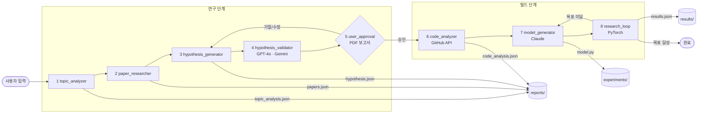

# Pipeline 모듈 상세

## 아키텍처 흐름



## 모듈별 역할

| 모듈 | 역할 | 입력 | 출력 |
|---|---|---|---|
| topic_analyzer.py | 연구 주제 구조화 | 사용자 입력 4종 | topic_analysis.json |
| paper_researcher.py | arXiv/Semantic Scholar 논문 검색 | topic_analysis.json | papers_{topic}.json |
| hypothesis_generator.py | Claude로 가설 생성 | topic + papers | hypothesis_{topic}.json |
| hypothesis_validator.py | GPT-4o + Gemini 검증 | hypothesis | 검증 결과 포함된 hypothesis |
| user_approval.py | PDF 보고서 생성 + 승인 CLI | topic + hypothesis + papers | approval_{topic}.json |
| code_analyzer.py | GitHub 코드 분석 | topic + hypothesis | code_analysis.json |
| model_generator.py | PyTorch 모델 코드 생성 | topic + hypothesis + code_analysis | experiments/{topic}_{version}.py |
| research_loop.py | 실험 반복 실행 | model_file + meta | results/{experiment_id}.json |

## 실행 명령

```bash
# 단계별 독립 실행
python -m lab.topic_analyzer --topic "..." --details "..." \
    --problem "..." --outcome "..." --constraints "..." --metric "PSNR, SSIM"

python -m lab.paper_researcher --topic-file reports/topic_analysis.json

python -m lab.hypothesis_generator \
    --topic-file reports/topic_analysis.json \
    --papers-file reports/papers_{topic}.json

python -m lab.hypothesis_validator \
    --hypothesis-file reports/hypothesis_{topic}.json

python -m lab.user_approval \
    --topic-file reports/topic_analysis.json \
    --hypothesis-file reports/hypothesis_{topic}.json \
    --papers-file reports/papers_{topic}.json

python -m lab.code_analyzer \
    --topic-file reports/topic_analysis.json \
    --hypothesis-file reports/hypothesis_{topic}.json

python -m lab.model_generator \
    --topic-file reports/topic_analysis.json \
    --hypothesis-file reports/hypothesis_{topic}.json \
    --code-file reports/code_analysis.json

python -m lab.research_loop \
    --model-file experiments/{topic}_v1.py \
    --meta-file reports/model_meta_v1.json
```

## LLM 설정 (config.py)

| 역할 | 모델 | API |
|---|---|---|
| 논문 분석 / 가설 생성 / 코드 생성 | `claude-opus-4-6` | Anthropic |
| 가설 검증 | `gpt-5.1` | OpenAI |
| 가설 검증 | `gemini-2.5-pro` | Google |

```python
CLAUDE_MODEL = "claude-opus-4-6"
OPENAI_MODEL = "gpt-5.1"
GEMINI_MODEL = "gemini-2.5-pro"
```

## 데이터 스펙

### 연구 주제 입력
```json
{
  "topic": "deep learning denoising",
  "details": "산업 데이터, 1번 scan한 이미지 denoising",
  "problem_definition": "단일 scan으로 얻은 산업용 이미지는 noise가 심하여 결함 검출 정확도가 낮음",
  "desired_outcome": "PSNR 30dB 이상, 실시간 처리 가능한 경량 모델",
  "constraints": "경량 모델, inference time 중요",
  "target_metric": "PSNR, SSIM"
}
```

### 실험 결과
```json
{
  "experiment_id": "exp_001",
  "hypothesis_id": "hyp_001",
  "config": {},
  "metrics": { "train_loss": [], "val_loss": [], "psnr": 0.0, "ssim": 0.0 },
  "claude_analysis": "",
  "next_suggestion": ""
}
```
